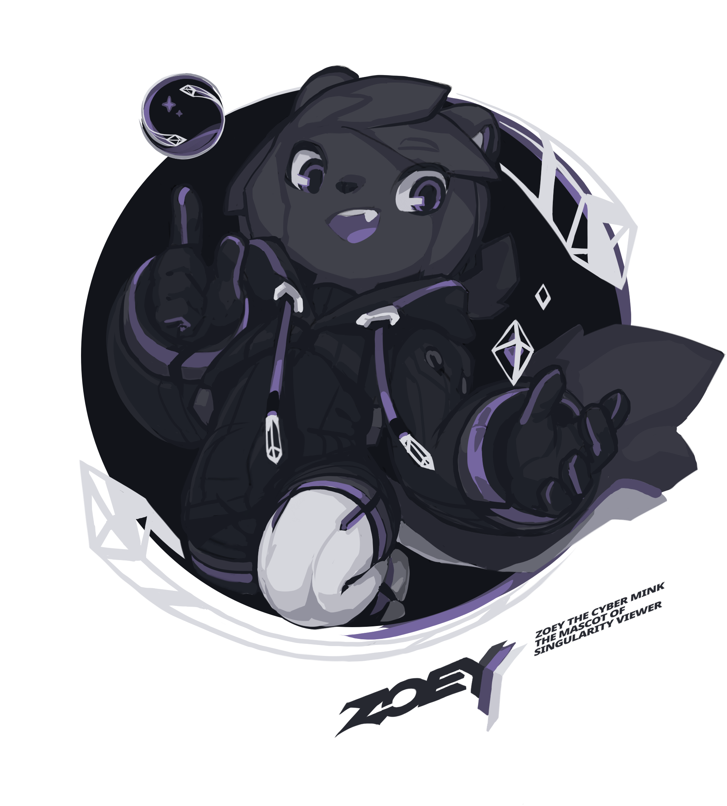

# Z1/Zoey
Z1/Zoey is the Singularity Viewer mascot created by [Tyson Tan](https://tysontan.com), and is dual licensed under the same license as our viewer as well as [Creative Commons BY-SA](https://creativecommons.org/licenses/by-sa/4.0/).

If you like this design and want one for your own project, Tyson Tan offers mascot design service for free and open source software, free of charge, under free license and can be reached via [email](tysontan@tysontan.com).

## Contributions
If you'd like to contribute some art or stories, we encourage you to open a pull request.
Know that contributing will place these contributions under the aforementioned licenses, unless a separate license is attached.

Please add a subfolder named after the artist in either `art/`, `stories/`, or a new directory that you find more appropriate for your contributions.

Contributions must be acceptable for the same audiences as the viewer (think "PG-13").

## Appearance
Zoey has two forms:
- The researcher, a white stoat, who can typically be found wearing a lab-coat and spectacles.
- Z1, a dark mink in a black hoodie, with our team’s logo on a bow on the back of his head.

### Symbolism/Meaning
- The portal (an incarnation of our logo) represents the Singularity, through which you travel to enter other (virtual) worlds.
- The contrast between the forms represents the duality of the real life and the virtual one.
- The "Shh" gesture implies the stealth of the virtual reality identity. We chose a mink for their ability to dive into the pool of virtual reality.

